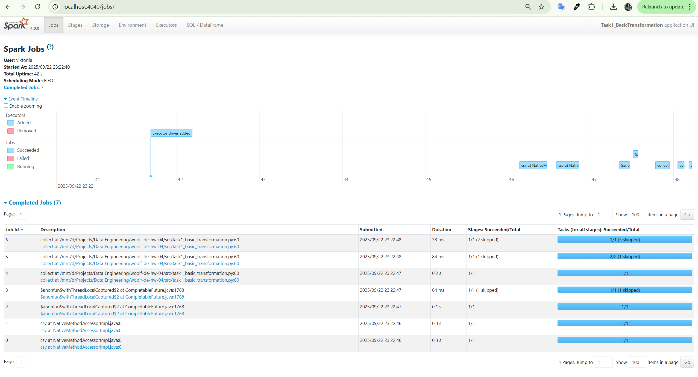
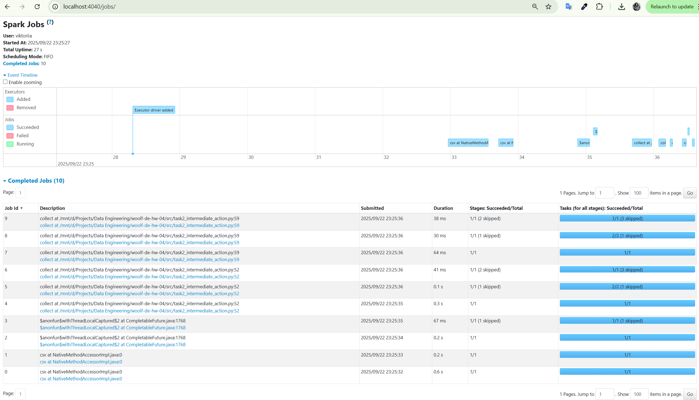
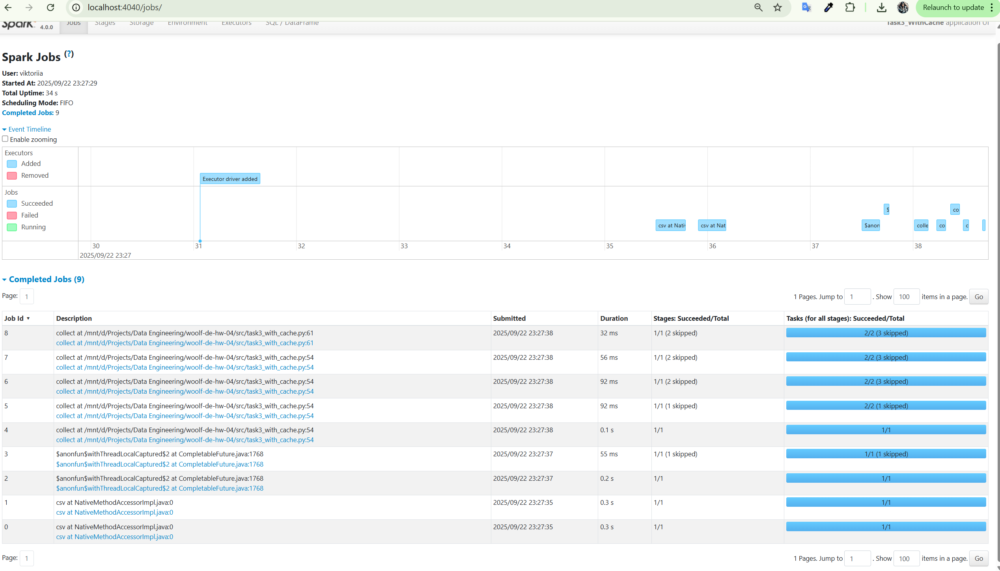

# woolf-de-hw-04

# Apache Spark: Optimization and SparkUI Analysis

## 📋 Опис завдання

Це домашнє завдання з курсу Data Engineering присвячене вивченню оптимізації Apache Spark через аналіз SparkUI. Ми досліджуємо вплив lazy evaluation, проміжних actions та кешування на кількість Jobs у Spark.

## 🎯 Мета роботи

- Зрозуміти різницю між lazy evaluation та actions у Spark
- Навчитися аналізувати SparkUI для оптимізації продуктивності
- Дослідити вплив функції `cache()` на виконання завдань
- Порівняти різні стратегії оптимізації через кількість Jobs

## 📊 Датасет

- **Файл**: `nuek-vuh3.csv`
- **Розташування**: `data/nuek-vuh3.csv`
- **Опис**: Датасет з інформацією про інциденти з полями unit_id, final_priority та іншими

## 🛠️ Налаштування середовища

### Вимоги
- Python 3.8+
- Java 8 або 11
- Apache Spark 3.5.0
- WSL2 (для Windows)

### Встановлення

1. **Клонування репозиторію:**
```bash
git clone https://github.com/yourusername/woolf-de-hw-04.git
cd woolf-de-hw-04
```

2. **Налаштування Java (WSL):**
```bash
sudo apt update
sudo apt install openjdk-11-jdk
export JAVA_HOME=/usr/lib/jvm/java-11-openjdk-amd64
export PATH=$JAVA_HOME/bin:$PATH
```

3. **Створення віртуального середовища:**
```bash
python3 -m venv venv
source venv/bin/activate
```

4. **Встановлення залежностей:**
```bash
pip install -r requirements.txt
```

## 🚀 Виконання завдань

### Завдання 1: Базова трансформація (7 Jobs)

Демонструє lazy evaluation - всі трансформації виконуються разом при виклику `collect()`.

```bash
python src/task1_basic_transformation.py
```

**Особливості коду:**
- Додаткова фільтрація `where("count>2")` після групування
- Єдиний виклик `collect()` в кінці
- Всі трансформації виконуються в одному ланцюжку

**Результат SparkUI:**


*Скріншот 1: Базова трансформація з lazy evaluation - 7 Jobs*

---

### Завдання 2: Проміжна дія без кешування (10 Jobs)

Показує вплив проміжних actions без кешування, що призводить до повторного виконання.

```bash
python src/task2_intermediate_action.py
```

**Особливості коду:**
- Два виклики `collect()` - до і після додаткової фільтрації
- Без кешування Spark перевиконує весь pipeline
- Додаткові Jobs через повторне читання та обробку даних

**Результат SparkUI:**


*Скріншот 2: Проміжна дія без кешування - 10 Jobs*

---

### Завдання 3: Використання cache() (9 Jobs)

Демонструє оптимізацію через кешування проміжних результатів.

```bash
python src/task3_with_cache.py
```

**Особливості коду:**
- Використання `.cache()` після групування
- Перший `collect()` зберігає дані в пам'яті
- Другий `collect()` використовує кешовані дані

**Результат SparkUI:**


*Скріншот 3: Оптимізація з cache() - 9 Jobs*

## 📈 Порівняльний аналіз

| Завдання | Кількість Jobs | Пояснення |
|----------|---------------|-----------|
| **Task 1** | 7 | Lazy evaluation - всі трансформації в одному виконанні |
| **Task 2** | 10 | Повторне виконання через відсутність кешування |
| **Task 3** | 9 | Оптимізація завдяки cache() - менше повторних обчислень |

## 🔍 Ключові висновки

### Lazy Evaluation
- Spark відкладає виконання до виклику action
- Оптимізує план виконання перед запуском
- Зменшує кількість проходів по даних

### Функція cache()
- **Переваги:**
  - Зберігає проміжні результати в пам'яті
  - Уникає повторних обчислень
  - Прискорює виконання при множинних діях
  
- **Коли використовувати:**
  - Ітеративні алгоритми
  - Множинні actions на одному DataFrame
  - Дорогі обчислення, що використовуються повторно

### Оптимізація Jobs
- Менше Jobs ≠ завжди краща продуктивність
- Важливо враховувати складність кожного Job
- Cache має сенс при повторному використанні даних

## 📂 Структура проекту

```
woolf-de-hw-04/
├── README.md                    # Цей файл
├── requirements.txt              # Python залежності
├── .gitignore                   # Git виключення
├── data/
│   └── nuek-vuh3.csv           # Датасет
├── src/
│   ├── task1_basic_transformation.py
│   ├── task2_intermediate_action.py
│   └── task3_with_cache.py
├── screenshots/
│   ├── task1_7_jobs.png
│   ├── task2_10_jobs.png
│   └── task3_9_jobs.png
└── docs/
    └── analysis.md              # Детальний аналіз результатів
```

## ⚠️ Важливі нотатки

- **Порт 4040**: Якщо зайнятий, Spark автоматично використає 4041, 4042...
- **Пам'ять**: При роботі з великими датасетами може знадобитися збільшити heap size
- **WSL Path**: Скрипти автоматично визначають шлях для WSL

## 📚 Додаткові ресурси

- [Apache Spark Documentation](https://spark.apache.org/docs/latest/)
- [SparkUI Guide](https://spark.apache.org/docs/latest/web-ui.html)
- [RDD Programming Guide](https://spark.apache.org/docs/latest/rdd-programming-guide.html)
